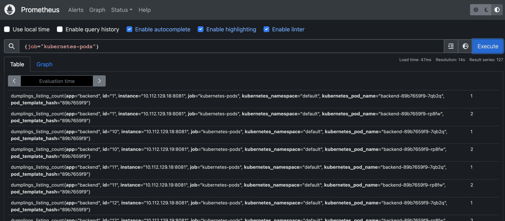
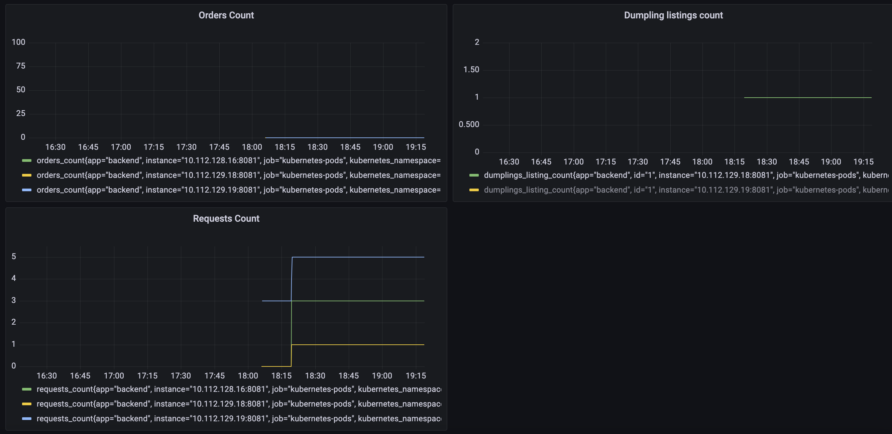

# Momo Store aka Пельменная №2


## Frontend

```bash
npm install
NODE_ENV=production VUE_APP_API_URL=http://localhost:8081 npm run serve
```

## Backend

```bash
go run ./cmd/api
go test -v ./... 
```
### описание проекта

##  проектная структура
```
├── README.md
├── backend
│   ├── .gitlab-ci.yml
│   └── Dockerfile
├── frontend
│   ├── .gitlab-ci.yml
│   └── Dockerfile
└── infrastructure
    ├── momo-store-chart
    │   ├── charts
    │   ├── .gitlab-ci.yml
    │   └── values.yaml
    └── terraform
```
## CI/CD

Приложение разворачивается с использовванием downstream-pipeline, триггером для каждого является любое изменение в папке с конкретным сервисом.

Проходят этапы сборки проекта, тестирования, загрузки в соответствующие хранилища(Nexus для Helm, Gitlab Container Registry для образов Docker) и пуша в prod-среду helm'ом

## версионирование

SemVer 2.0.0
мажорные и минорные версии приложения изменяются вручную в файлах backend/.gitlab-ci.yaml и frontend/.gitlab-ci.yaml в переменной VERSION
патч-версии изменяются автоматически на основе переменной CI_PIPELINE_ID
для инфраструктуры версия приложения изменяется вручную в чарте infrastructure/momo-store-helm/Chart.yaml

Используется SemVer 2.0.0
Версии релиза изменяются в паеременной VERSION, которая зависит от CI_PIPELINE_ID
Версии для Helm-чарта изменяются в самом Chart.yaml

## работа с нашим приложением

1. Создаём Object Storage и сервисный аккаунт в Yandex.Cloud, через веб-интерфейс.
2. Также через веб-интерфейс создаём статический ключ для хранилища. Экспортируем ключи в переменную окружения:
```
export AWS_ACCESS_KEY_ID="<Идентификатор ключа>"
export AWS_SECRET_ACCESS_KEY="<Ваш секретный ключ>"
```
3. Создаём кластер в Yandex.Cloud через terraform
```cd terraform
terraform init 
terraform apply -var "iam_token=$(yc iam create-token)"
```
4. Смотрим через веб-интерфейс ID кластера и записываем его:
```
yc managed-kubernetes cluster get-credentials --id <id_кластера> --external
```
5. Устанавливаем Ingress-контроллер NGINX, для этого можно воспользоваться инструкцией Yandex.Cloud:

https://cloud.yandex.ru/docs/managed-kubernetes/tutorials/ingress-cert-manager

5. Смотрим наш внешний IP-адресс у Ingress-контроллера:
```
kubectl get svc/ingress-nginx-controller | head -n 2 | awk '{print $4}'
```
Вторая строка - нужный нам IP-Адрес.

6. Дальше у нашего регистратора доменного имени указываем A-запись с IP-адресом, полученным из предыдущего пункта.

7. Создаём манифесты acme-issuer.yaml и ingress.yaml
где acme-issuer.yaml:
```
apiVersion: cert-manager.io/v1
kind: ClusterIssuer
metadata:
  name: letsencrypt
  namespace: cert-manager
spec:
  acme:
    server: https://acme-v02.api.letsencrypt.org/directory
    email: <емейл-адрес>
    privateKeySecretRef:
      name: letsencrypt
    solvers:
    - http01:
        ingress:
          class: nginx
```
ingress.yaml:
```
apiVersion: networking.k8s.io/v1
kind: Ingress
metadata:
  name: minimal-ingress
  annotations:
    kubernetes.io/ingress.class: "nginx"
    cert-manager.io/cluster-issuer: "letsencrypt"
spec:
  tls:
    - hosts:
      - <наше_доменное_имя>
      secretName: letsencrypt
  rules:
    - host: <наше_доменное_имя>
      http:
        paths:
        - path: /
          pathType: Prefix
          backend:
            service:
              name: frontend
              port:
                number: 80
```
Применяем манифесты:
```
kubectl apply -f acme-issuer.yaml && \
kubectl apply -f ingress.yaml
```

8. Для того, чтобы скачивать Docker-образы из Gitlab Container Registry, нам понадобится создать секрет с нашими данными:
```
kubectl create secret docker-registry docker-config-secret --docker-server=gitlab.praktikum-services.ru:5050   --docker-username=<вой_логин>   --docker-password=<свой_пароль>
```
Cервис-аккаунт:
```
kubectl create serviceaccount <имя_аккаунта>
kubectl patch serviceaccount <имя_аккаунта> -p '{"imagePullSecrets": [{"name": "docker-config-secret"}]}' -n default 
```

## мониторинг

Мониторинг построен на базе учебного репозитория:
https://gitlab.praktikum-services.ru/root/monitoring-tools





Графана доступна по внешней ссылке:

https://grafana-momo-dumplings.chickenkiller.com/

